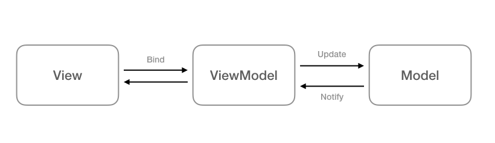

# ProductApp
this simple demo to MVVM with TDD

# screen of the app

* Digram 

  
  
  # Architecture
I choose to use MVVM (Model View View Model) separates your view (i.e. Activitys and Fragments) from your business logic. MVVM is enough for small projects, but when your codebase becomes huge, your ViewModels start bloating. Separating responsibilities becomes hard.

MVVM with Clean Architecture is pretty good in such cases. It goes one step further in separating the responsibilities of your code base. It clearly abstracts the logic of the actions that can be performed in your app.

# Note
- Support iOS 13.0

# Screen APP

* Home Screen

  
